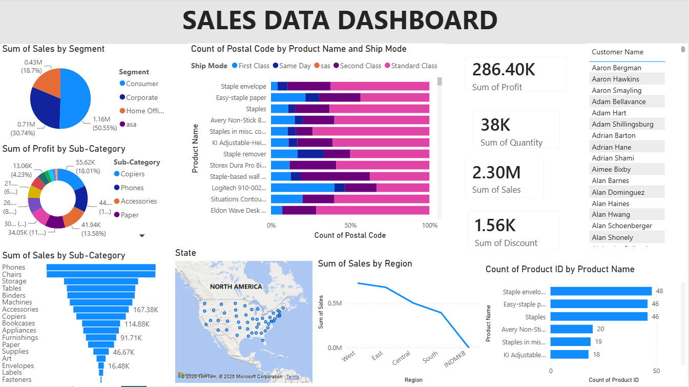

# 📊 Business Analytics Dashboard | Power BI
This project is an interactive Business Analytics Dashboard developed using Microsoft Power BI. It transforms raw business data into meaningful insights through dynamic visualizations and key performance indicators (KPIs), enabling users to monitor performance and make data-driven decisions.

## Key Features

- 📈 Sales trend analysis using line charts
- 📊 KPI cards for key business metrics
- 🌍 Geographic analysis with interactive maps
- 🥧 Category-wise performance using pie and donut charts
- 🔻 Funnel chart for process/conversion analysis
- 📋 Detailed transaction table
- 📊 Comparative analysis with bar and stacked bar charts
- 🔍 Interactive filtering and drill-down capabilities

## Tools & Technologies

- Microsoft Power BI
- DAX (Data Analysis Expressions)

## Dashboard Highlights

- Track overall business performance
- Analyze trends over time
- Compare category-wise sales and profit
- Identify top-performing regions
- Visualize business KPIs
- Generate actionable business insights

## Skills Demonstrated

- Data Cleaning & Transformation
- Data Modeling
- DAX Measures
- Interactive Dashboard Design
- Business Intelligence
- Data Visualization
## Dashboard Preview

